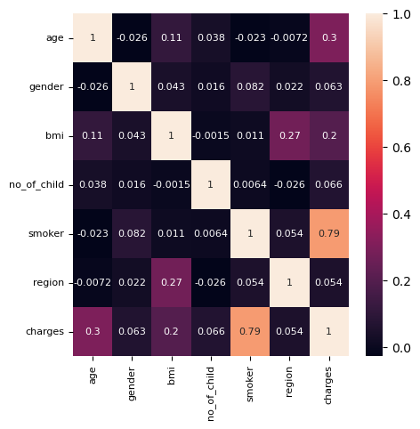

# Medical Insurance Premium Prediction Using Ridge Regression Model
This project aims to identify the most important factors influencing medical insurance prices and to build robust machine learning models for prediction. By leveraging data sourced from Kaggle, the ultimate goal is to explore how predictive models can enhance the efficiency and profitability of health insurance companies through better risk assessment and cost management.

Data source: https://www.kaggle.com/datasets/harishkumardatalab/medical-insurance-price-prediction?resource=download

## Technical Skills Highlighted
- Conducted data preprocessing, including cleaning datasets, handling missing values, and performing EDA with visualizations to identify key attributes.
- Developed and evaluated single-variable, multi-variable, and Ridge regression models, leveraging polynomial transformations and hyperprameter tuning to improve predictions and reduce overfitting.
- Adept at model evaluation using metrics such as R square and MSE to measure predictive accuracy and ensure robustness.

### Correlation Analysis
Correlation analysis shows a strong positive correlation (0.79) between smoker and premium, indicating that smoking status significantly influences medical expenses. In comparison, age and BMI show weaker correlations with charges, at 0.3 and 0.2 respectively, though they are still stronger compared to correlations of other variables.

### Model Development and Refinement

1. Linear Regression 

   Z = df[['age','bmi','gender','no_of_child','region','smoker']]

   lm.fit(Z,Y)

   **R2_score with all attributes is: 0.75)**
   
2. Adjust the model with polynomial and standard scaler using pipeline.

   input = [('scale',StandardScaler()),('Polynomial',PolynomialFeatures(include_bias=False)),('model',LinearRegression())]

   pipe = Pipeline(input)

   pipe.fit(Z,Y)

   ypipe = pipe.predict(Z)

   **The R2 score increases from 0.75 to 0.845.**

3. Use Ridge Regression Model

Experimented the performance by tuning the model with differnt Ridge regression alpha with parameter grid search, and apply polynomial transformation to the training parameters.

   ridge_model2= Ridge(alpha=1)

   pr = PolynomialFeatures(degree=2)

   x_train_pr = pr.fit_transform(x_train)

   x_test_pr = pr.fit_transform(x_test)

   ridge_model2.fit(x_train_pr, y_train)

   y_hat = ridge_model2.predict(x_test_pr)

The machine learning model was developed and refined to predict medical insurance prices, achieving an **R2 score of 0.783** on the test dataset. This score indicates that the model explains approximately 78.3% of the variance in medical insurance prices, reflecting a solid predictive capability. The refinement process included regularization through Ridge regression to prevent overfitting, hyperparameter tuning to identify the optimal alpha value, and polynomial transformations to enhance feature interactions and capture non-linear relationships.

### Key Findings
1. The analysis revealed that among the six attributes—age, gender, BMI, number of children, smoker status, and region. Smoker status emerged as the most influential factor in determining insurance prices. This highlights the significant cost burden associated with smoking-related health risks. 
2. Age and BMI were moderately correlated with insurance prices, indicating that older age and higher BMI are associated with increased costs.
3. Attributes like gender, number of children, and region showed weaker impacts but still contributed to the overall prediction.

### Implications on Medical Insurance Pricing
1. Identifying key cost drivers, smoking, allows insurers to design targeted risk assessment strategies and personalized premiums.
2. Insights into the impact of BMI and age suggest opportunities for wellness programs and lifestyle interventions to mitigate long-term costs.
3. The weaker influence of attributes like gender and region indicates that pricing models can focus on more critical factors without overly penalizing certain demographics.
